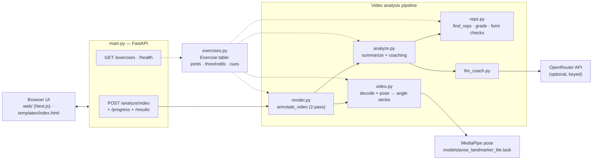
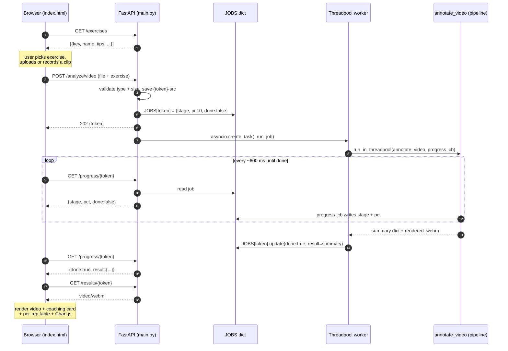
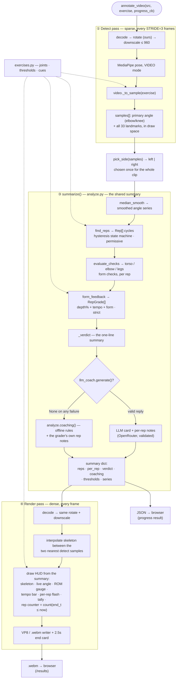

# How the pipeline works

Upload *or* record a side-on clip of one of three exercises → the reps are counted
and graded, the analysis is painted back onto the video, and a coaching card says
what to work on next. The whole thing is a straight line:

> **exercise config → signal → meaning → one shared summary → two views of it (JSON + video)**

Three diagrams: the system at a glance, the request lifecycle over time, then the
analysis pipeline in detail.

---

## 1. System overview

Which module talks to which. `exercises.py` is the config seam — a table of numbers
and strings the whole pipeline reads (dotted lines), so adding a movement is a new
row, not a new code path.

The pluggable MediaPipe/YOLO seam (`backends.py`, with `analyzer.py` as its
single-frame harness) survives from the Phase-0 POC for offline work — the boot
banner, `/health`, `scripts/compare_backends.py` — but no request path runs
through it anymore. The **video** path — the product — uses MediaPipe's Tasks
API in VIDEO mode directly (it needs tracking state across frames), which is why
it doesn't go through `backends.py`.

---

## 2. Request lifecycle — the job/poll model

The upload doesn't block for ~20 s. `POST /analyze/video` returns a **token**
immediately (202); the heavy work runs in a threadpool worker and reports progress
into an in-memory `JOBS` dict; the page **polls** `/progress/{token}` (~600 ms) to
drive a real bar. Polling, not SSE — SSE buffers behind the hosting proxy.

Both `JOBS` and the rendered `.webm`s are disposable — an in-memory dict and a temp
dir, pruned by age/count, gone on restart. No accounts, no DB, no history (a
deliberate guardrail).

---

## 3. The analysis pipeline — `annotate_video()`

The heart of it. **Two passes** over the clip with **one shared summary** in the
middle. The sparse detect pass produces the numbers; `summarize()` turns them into
meaning *once*; the dense pass paints that same summary onto every frame. Because
both the JSON and the on-screen counter read the *same* `per_rep` list, they can
never disagree about how many reps you did.

---

## The seams that hold it together

- **`summarize()` = one number, two views.** The rep count in the JSON table and the
  counter burned onto the video come from the *same* `per_rep` list — the overlay
  counter is literally `count(end_t ≤ now)` over it. Computed once, drawn twice.
- **An exercise is data, not code.** A curl and a squat are the same
  high→low→high signal; only *which joint*, *which thresholds*, and *which cues*
  differ. That's a row in `exercises.py`. `video.py` / `reps.py` / `render.py`
  never hard-code "elbow" — a squat's knee is drawn exactly like a curl's elbow.
- **Detect permissive, grade strict.** `find_reps` counts every cycle that moves
  (so a sloppy half-rep is *seen*); `form_feedback` is the strict judge of depth,
  tempo and form. Two layers, deliberately kept apart.
- **The LLM can only add quality, never break the app.** `llm_coach.generate()`
  returns valid coaching *or* `None` on any failure (no key, timeout, bad JSON,
  refusal, rate cap, feature off). `None` falls back to the offline rule-based
  `analyze.coaching()`, so the card reads the same shape with or without a key.
  Per-rep notes ride the same contract: the LLM's flash/coach text overlays the
  grader's deterministic notes only if the reply covers every rep and passes the
  length caps (`meta.rep_notes_source` says which text shipped).
- **Sparse detect, dense draw.** Detection runs at `STRIDE=3`; the skeleton is
  interpolated between samples, never re-detected per frame — fast, and the count
  stays exact because it comes from the one detection pass.

---

## Where to start reading

| You want to… | Start in |
| --- | --- |
| follow a request end-to-end | `main.py` → `render.annotate_video` |
| understand rep counting | `reps.py` (`find_reps` + its tests) |
| change a threshold or add a movement | `exercises.py` |
| see how the overlay is drawn | `render.py` (`_draw_hud`, `_draw_rom_gauge`) |
| shape the JSON/summary | `analyze.py` (`summarize`) |
